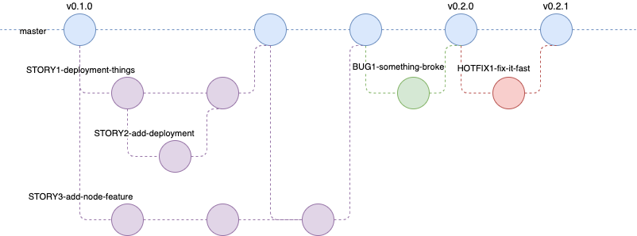

# The Jimflow Branching and Release Strategy
## There can be only one... strategy that is
The chosen branching strategy is Jimflow.  Details regarding this strategy can be found within Jim's head.  To get there you take a left then a right, then continue walking until you see a brick wall.  Proceed to bang your head into the wall three times while repeating "There's no place like Jim's head."  You will now be magically transported to Jim's head.  My condolences.

# Why are we using this workflow?
Traditional Gitflow has a few pitfalls which can largely be avoided by simplifying the branching strategy.

Some goals of this strategy are:
* Prevent difficult merge conflicts which come from attempting to shoehorn hotfixes and release branches into both Master and Develop branches simultaneously.
* Avoid complexity and clutter by reducing the number of long running branches.
* TODO: Figure out how to word issues about deployments

The different types of branches we may use are:

* Master
* Feature, bugfix, and hotfix branches

# Branches

## Master
The Master branch will be named `master` and will contain the entire history.  All branches will merge back into master eventually.  Releases will be tagged commits.  CI pipelines will monitor `master` for tags with symver version in the format `v#.#.#` and build on these.

## Feature, Bugfix, and Hotfix
* Because all branches have effectively the same behavior they become much more flexible and the differences between them become more of a naming convention than anything else.
* Feature branches are used when developing a new feature or enhancement.  They are flexible as there may be cases where it makes sense to branch a feature off of a feature allowing multiple developers to work on related code.  In this event the branch should be merged back into the source if possible.  If the source branch has been merged into `master` then the developer will merge his/her branch into `master` as well.
* Feature branches should correspond with a story in Jira.  Long running branches should be avoided and features will ideally be atomic.
* During the lifetime of the feature branch the developer should keep an eye on the source branch and should frequently merge the source branch back into the feature branch.  This is done to avoid large merge conflicts.  Time to handle merge conflicts should be accounted for.
* Feature branch names should have a prefix of the Jira story number followed by a brief and human readable description of the work contained within the branch or the name of the story itself (when using Jira to create branches).  The fields should be separated by hyphens and slashes will not be used.  The syntax is `[story number]-[brief-description]`.
    * Example: `SSP1-246-add-leveldb`.  In this case `SSP1-246` was the story in Jira and `add-leveldb` describes the content which was the addition of LevelDB to the container image.
    * Allowing the use of short descriptions instead of the ticket name prevents branches with duplicate names in the event it makes sense to have multiple branches for the same story.
* Bugfix and Hotfix branches should follow the same proceedures.
* Bugfixes may branch from both `master` and feature branches.
* Hotfixes will branch from `master`.